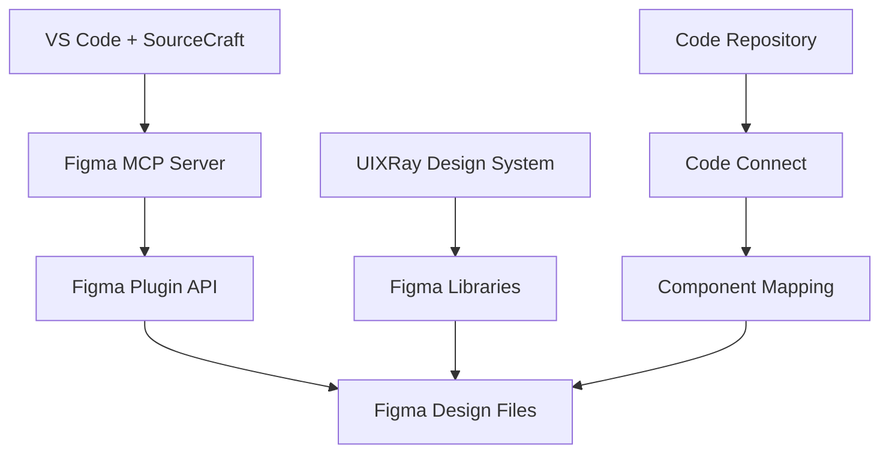

# Figma MCP Integration Guide for UIXRay Design System

## Обзор

Это руководство описывает интеграцию Figma MCP (Model Context Protocol) с плагином SourceCraft для редактирования макетов Figma непосредственно из Visual Studio Code. Интеграция позволяет AI-агенту выполнять операции чтения и записи в Figma файлы, синхронизировать дизайн с кодом и автоматизировать рутинные задачи.

## Архитектура



## Преимущества интеграции

### Для дизайнеров

- **Автоматизация рутины**: Создание вариаций компонентов, обновление текста, настройка Auto Layout
- **Консистентность**: Автоматическое применение токенов дизайн-системы
- **Быстрое прототипирование**: Генерация макетов из текстовых описаний

### Для разработчиков

- **Синхронизация с кодом**: Автоматическое обновление дизайна при изменении компонентов
- **Дизайн-ревью в контексте**: Просмотр дизайна прямо в VS Code
- **Единый workflow**: Не нужно переключаться между Figma и IDE

### Для команды

- **Единый источник истины**: Дизайн и код всегда синхронизированы
- **Автоматизированная документация**: Генерация спецификаций из дизайна
- **Масштабирование**: Возможность управлять большими дизайн-системами

## Требования

### Обязательные

1. **Figma аккаунт** с Full Seat или Dev Seat (Professional/Organization/Enterprise)
2. **VS Code** версии 1.90+
3. **SourceCraft plugin** с поддержкой MCP
4. **Доступ к Figma Plugin API**

### Рекомендуемые

1. **UIXRay Design System** опубликованный как библиотека в Figma
2. **Code Connect** для связи компонентов кода с дизайном
3. **Figma Variables** для управления токенами дизайн-системы

## Быстрый старт

### 1. Установка и настройка

```bash
# Клонируйте репозиторий если еще не сделали
git clone <repository-url>
cd "UIXRay Design System"

# Структура уже содержит необходимые файлы:
# - .codeassistant/mcp.json
# - .codeassistant/rules/figma-use.md
# - .codeassistant/prompts/*.md
# - .codeassistant/config/*.json
```

### 2. Настройка Figma MCP Server

1. Откройте VS Code с проектом
2. Убедитесь что плагин SourceCraft установлен и авторизован
3. Сервер Figma MCP уже настроен в `.codeassistant/mcp.json`
4. При первом использовании пройдите OAuth авторизацию

### 3. Тестирование интеграции

Откройте чат SourceCraft и выполните тестовый запрос:

```
"Проверь доступность Figma MCP инструментов"
```

Или создайте тестовый файл:

```
"Создай тестовый файл Figma с названием 'UIXRay MCP Test'"
```

## Навыки (Skills) и их использование

### Обязательный навык: `figma-use`

**Назначение**: Базовые правила работы с Figma Plugin API  
**Расположение**: `.codeassistant/rules/figma-use.md`  
**Когда использовать**: Перед ЛЮБЫМ вызовом `use_figma`

```javascript
// Пример использования навыка
// Агент автоматически применяет правила из figma-use.md
await use_figma({
  script: `// Код для создания компонента...`,
});
```

### Навык: `figma-generate-design`

**Назначение**: Создание дизайнов из описаний  
**Расположение**: `.codeassistant/prompts/figma-generate-design.md`  
**Использование**:

```
"Используя компоненты UIXRay, создай экран профиля пользователя с аватаром,
информацией и настройками"
```

### Навык: `figma-implement-design`

**Назначение**: Синхронизация дизайна с изменениями в коде  
**Расположение**: `.codeassistant/prompts/figma-implement-design.md`  
**Использование**:

```
"На основе изменений в компоненте Button в src/components/Button.tsx,
обнови компонент Button в Figma файле <URL>"
```

### Навык: `figma-create-new-file`

**Назначение**: Создание новых файлов Figma/FigJam  
**Расположение**: `.codeassistant/prompts/figma-create-new-file.md`  
**Использование**:

```
"Создай новый дизайн-файл для прототипирования мобильного приложения"
```

## Инструменты Figma MCP

### Основные инструменты

| Инструмент             | Тип    | Описание                              | Пример использования          |
| ---------------------- | ------ | ------------------------------------- | ----------------------------- |
| `use_figma`            | Запись | Исполнение JS кода в Figma Plugin API | Создание/редактирование узлов |
| `get_design_context`   | Чтение | Извлечение структуры макета           | Анализ существующего дизайна  |
| `create_new_file`      | Запись | Создание нового файла                 | Начало нового проекта         |
| `get_screenshot`       | Чтение | Получение изображения узла            | Визуальная проверка           |
| `search_design_system` | Чтение | Поиск в библиотеках                   | Поиск компонентов/токенов     |
| `get_metadata`         | Чтение | Получение иерархии                    | Навигация по файлу            |

### Примеры использования инструментов

#### 1. Чтение дизайна

```javascript
// Получение контекста дизайна
const context = await get_design_context({
  fileUrl: "https://figma.com/file/ABC123",
  includeProperties: ["name", "type", "bounds"],
});
```

#### 2. Поиск в дизайн-системе

```javascript
// Поиск компонентов
const buttonComponents = await search_design_system({
  query: "button",
  types: ["COMPONENT"],
  library: "UIXRay Design System",
});
```

#### 3. Создание скриншота

```javascript
// Получение скриншота для проверки
const screenshot = await get_screenshot({
  nodeId: "1:23",
  format: "png",
  scale: 2,
});
```

## Интеграция с UIXRay Design System

### Использование токенов дизайн-системы

#### Цветовые токены

```javascript
// Вместо жестких HEX значений
// ❌ Плохо
node.fills = [{ type: "SOLID", color: { r: 0.2, g: 0.4, b: 0.8 } }];

// ✅ Хорошо - используйте переменные
const primaryColor = await getColorVariable("primal/primary/500");
if (primaryColor) {
  node.fills = [{ type: "SOLID", color: primaryColor }];
}
```

#### Токены spacing

```javascript
// Используйте токены из 05-tokens/
const spacingTokens = {
  xs: 4,
  sm: 8,
  md: 16,
  lg: 24,
  xl: 32,
};

container.paddingTop = spacingTokens.md;
container.paddingBottom = spacingTokens.md;
container.itemSpacing = spacingTokens.sm;
```

### Компоненты UIXRay в Figma

Структура компонентов соответствует организации в `01-design-system/components/`:

| Компонент кода | Компонент Figma | Библиотека           |
| -------------- | --------------- | -------------------- |
| `Button`       | `Button`        | UIXRay Design System |
| `Input`        | `Input Field`   | UIXRay Design System |
| `Card`         | `Card`          | UIXRay Design System |
| `Avatar`       | `Avatar`        | UIXRay Design System |

## Рабочие процессы (Workflows)

### Workflow 1: Создание нового компонента

1. **Создание в коде**: Разработчик создает React компонент
2. **Синхронизация с Figma**:
   ```bash
   # Агент автоматически создает соответствующий компонент в Figma
   "На основе нового компонента Modal в src/components/Modal.tsx,
    создай компонент Modal в Figma библиотеке UIXRay"
   ```
3. **Добавление вариантов**: Агент создает варианты (default, large, with-icon)
4. **Публикация**: Компонент публикуется в библиотеке

### Workflow 2: Обновление дизайн-токенов

1. **Изменение токенов**: Дизайнер обновляет токены в `05-tokens/`
2. **Синхронизация с Figma**:
   ```bash
   "Обнови цветовые переменные в Figma на основе
    изменений в 05-tokens/semantic/color.tokens.json"
   ```
3. **Применение к компонентам**: Агент обновляет все компоненты использующие токены
4. **Верификация**: Проверка консистентности через скриншоты

### Workflow 3: Дизайн-ревью в контексте кода

1. **Запрос ревью**: Разработчик создает PR
2. **Автоматическая проверка**:
   ```yaml
   # В CI/CD pipeline
   - name: Check design consistency
     run: |
       # Использует MCP для проверки соответствия кода дизайну
       npx sourcecraft design-check --pr $PR_NUMBER
   ```
3. **Комментарии в Figma**: Агент создает комментарии в Figma с ссылками на код
4. **Итерация**: Дизайнер вносит правки прямо из комментариев в VS Code

## Примеры запросов

### Для дизайнеров

```
"Создай мобильную версию экрана дашборда используя компоненты UIXRay"
```

```
"Добавь вариант компонента Button в состоянии loading с индикатором"
```

```
"Обнови все экраны чтобы использовать новую цветовую палитру из токенов"
```

### Для разработчиков

```
"На основе изменений в Card компоненте, обнови макет страницы Products"
```

```
"Создай прототип новой фичи поиска с фильтрами"
```

```
"Проверь соответствие реализованного интерфейса макету в Figma"
```

### Для менеджеров

```
"Создай FigJam файл с user journey для новой onboarding flow"
```

```
"Сгенерируй спецификацию компонентов для документации"
```

```
"Подготовь скриншоты всех экранов для презентации"
```

## Ограничения и обходные пути

### Ограничение: 20KB лимит на ответ `use_figma`

**Обход**: Разбивайте большие изменения на чанки

```javascript
// ❌ Слишком большой скрипт
await use_figma(hugeScript);

// ✅ Разбить на части
await use_figma(scriptPart1); // Header
await use_figma(scriptPart2); // Content
await use_figma(scriptPart3); // Footer
```

### Ограничение: Нет доступа к локальным шрифтам

**Обход**: Используйте системные шрифты или корпоративные

```javascript
// ❌ Локальный шрифт
await figma.loadFontAsync({ family: "MyCustomFont", style: "Regular" });

// ✅ Системный шрифт
await figma.loadFontAsync({ family: "Inter", style: "Regular" });
```

### Ограничение: Нет поддержки растровых изображений

**Обход**: Используйте плейсхолдеры

```javascript
// Создайте прямоугольник как плейсхолдер
const placeholder = figma.createRectangle();
placeholder.fills = [{ type: "SOLID", color: { r: 0.9, g: 0.9, b: 0.9 } }];
placeholder.name = "Image Placeholder";
```

## Безопасность

### Управление доступом

1. **Токены**: Храните в `.env`, не коммитьте в репозиторий
2. **Разрешения**: Минимально необходимые scope
3. **Аудит**: Регулярно проверяйте историю действий

### Конфигурация безопасности

```json
{
  "mcpServers": {
    "figma": {
      "type": "http",
      "url": "https://mcp.figma.com/mcp",
      "allowedOperations": ["read", "write_drafts"],
      "requireConfirmation": true
    }
  }
}
```

## Мониторинг и отладка

### Логирование

```bash
# Включите детальное логирование
export SOURCECRAFT_LOG_LEVEL=debug

# Просмотр логов MCP
tail -f ~/.sourcecraft/logs/mcp-figma.log
```

### Метрики

- **Количество вызовов в день**: Следите за лимитами тарифа
- **Время выполнения**: Оптимизируйте медленные операции
- **Частота ошибок**: Решайте системные проблемы

### Отладка проблем

```javascript
// Добавьте отладочную информацию
try {
  const result = await use_figma(script);
  console.log("Success:", result);
} catch (error) {
  console.error("Error details:", {
    message: error.message,
    stack: error.stack,
    scriptSize: script.length,
  });
}
```

## Расширение функциональности

### Создание кастомных навыков

1. Создайте файл в `.codeassistant/prompts/`
2. Следуйте формату существующих навыков
3. Протестируйте и добавьте в документацию

### Интеграция с CI/CD

```yaml
# .github/workflows/design-sync.yml
name: Design Sync
on:
  push:
    paths:
      - "01-design-system/components/**"
      - "05-tokens/**"

jobs:
  sync-with-figma:
    runs-on: ubuntu-latest
    steps:
      - uses: actions/checkout@v3
      - name: Sync design tokens
        run: |
          npx sourcecraft figma-sync-tokens \
            --tokens-dir ./05-tokens \
            --figma-file ${{ secrets.FIGMA_FILE_KEY }}
```

### Плагины для специфических задач

Создайте специализированные плагины для:

- **Дизайн-ревью автоматизация**
- **Генерация документации**
- **Миграция между версиями дизайн-системы**

## Ресурсы

### Документация

- [Figma MCP Official Docs](https://www.figma.com/developers/mcp)
- [SourceCraft Plugin Documentation](https://sourcecraft.yandex.com/docs)
- [UIXRay Design System Docs](01-design-system/_index.md)

### Примеры кода

- [Примеры использования MCP](.codeassistant/examples/) (создайте директорию)
- [Шаблоны скриптов](07-figma/figma-plugin-api-reference.md)
- [Интеграционные тесты](tests/figma-mcp-integration.test.js)

### Сообщество

- [Figma Community Forum](https://forum.figma.com/)
- [SourceCraft Discord](https://discord.gg/sourcecraft)
- [MCP Community](https://community.modelcontextprotocol.io)

## Заключение

Интеграция Figma MCP с SourceCraft предоставляет мощный инструмент для bridge the gap между дизайном и разработкой. Используя эту интеграцию, команда UIXRay может:

1. **Автоматизировать** рутинные задачи дизайна
2. **Синхронизировать** дизайн и код в реальном времени
3. **Масштабировать** дизайн-систему с минимальными overhead
4. **Улучшить collaboration** между дизайнерами и разработчиками

Начните с простых задач и постепенно расширяйте использование по мере освоения инструментария.
